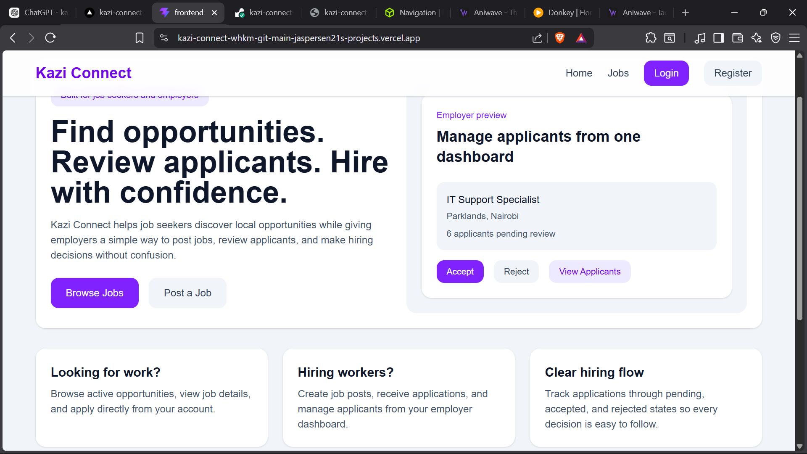
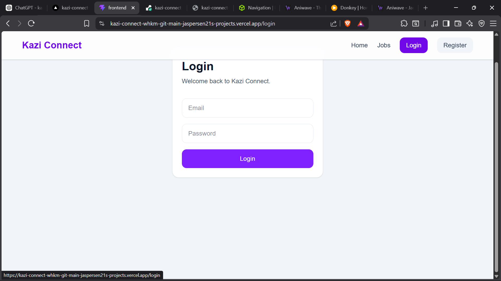
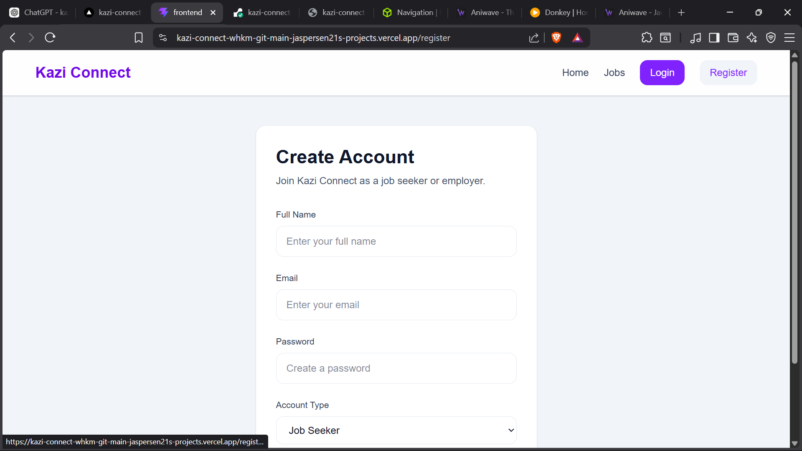
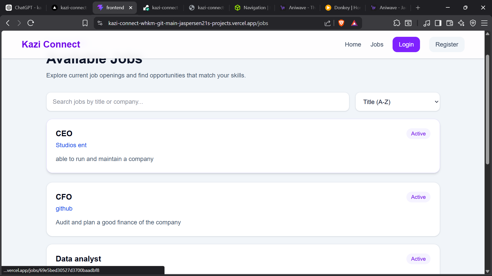

# 🚀 Kazi Connect

Kazi Connect is a full-stack job marketplace platform that connects employers and job seekers.

Job seekers can browse opportunities, apply for jobs, and track their applications, while employers can create job listings, manage applicants, and make hiring decisions through a dedicated dashboard.

Built with FastAPI, MongoDB Atlas, React, TypeScript, React Query, and Tailwind CSS.

---

## 🌐 Live Demo

### Frontend

https://kazi-connect-whkm-git-main-jaspersen21s-projects.vercel.app

### Backend API

https://kazi-connect-backend.onrender.com

### Swagger Documentation

https://kazi-connect-backend.onrender.com/docs

---

## 📸 Screenshots

### Home Page



### Login Page



### Register Page



### Jobs Page



---

## ⚙️ Tech Stack

### Frontend

* React
* TypeScript
* Vite
* React Router
* TanStack React Query
* Tailwind CSS

### Backend

* FastAPI
* PyMongo Async
* MongoDB Atlas
* Pydantic
* JWT Authentication

### Deployment

* Vercel
* Render
* MongoDB Atlas

---

## 🔐 Features

### Authentication

* User registration
* Secure login
* JWT authentication
* Protected routes
* Role-based access control

### Job Seeker Features

* Browse jobs
* Search jobs
* Sort jobs
* View job details
* Apply for jobs
* Track applications
* View application status

### Employer Features

* Create jobs
* Edit jobs
* Delete jobs
* Employer dashboard
* View applicants
* Accept applicants
* Reject applicants

### User Experience

* Loading states
* Error states
* Empty states
* Responsive design
* SPA routing support

---

## ⚡ React Query Features

Kazi Connect uses TanStack React Query for:

* Data fetching
* Mutations
* Cache invalidation
* Automatic refetching
* Loading state management
* Error handling

---

## 🏗️ Architecture

```text
React + TypeScript + React Query
                │
                ▼
          FastAPI Backend
                │
                ▼
          MongoDB Atlas
```

---

## 📂 Project Structure

```text
kazi-connect/
│
├── backend/
│   ├── app/
│   │   ├── core/
│   │   ├── database/
│   │   ├── routers/
│   │   ├── schemas/
│   │   ├── services/
│   │   └── utils/
│   │
│   ├── main.py
│   └── requirements.txt
│
├── frontend/
│   ├── public/
│   ├── src/
│   │   ├── api/
│   │   ├── components/
│   │   ├── context/
│   │   ├── hooks/
│   │   ├── lib/
│   │   ├── pages/
│   │   ├── types/
│   │   ├── App.tsx
│   │   └── main.tsx
│   │
│   ├── package.json
│   └── vite.config.ts
│
├── screenshots/
├── README.md
└── TODO.md
```


---

## 🔌 API Endpoints

### Authentication

* `POST /auth/register`
* `POST /auth/login`

### Jobs

* `GET /jobs`
* `POST /jobs`
* `GET /jobs/{job_id}`
* `PUT /jobs/{job_id}`
* `DELETE /jobs/{job_id}`

### Applications

* `POST /jobs/{job_id}/apply`
* `GET /applications/me`
* `GET /jobs/{job_id}/applications`

### Employer Dashboard

* `GET /employer/jobs`

---

## 🛠️ Local Development

### Backend

```bash
cd backend

python -m venv venv

venv\Scripts\activate

pip install -r requirements.txt

uvicorn app.main:app --reload
```

### Frontend

```bash
cd frontend

npm install

npm run dev
```

---

## 🔑 Environment Variables

### Backend

```env
MONGO_URI=your_mongodb_connection_string
DB_NAME=kazi_connect
SECRET_KEY=your_secret_key
ALGORITHM=HS256
ACCESS_TOKEN_EXPIRE_MINUTES=30
```

### Frontend

```env
VITE_API_URL=https://kazi-connect-backend.onrender.com
```

---

## 🚀 Deployment

### Frontend

* Vercel

### Backend

* Render

### Database

* MongoDB Atlas

---

## 🚧 Roadmap

Upcoming features:

* Job closing workflow
* Pagination UI
* User profile page
* M-Pesa integration
* Email notifications
* Employer analytics

---

## 👨‍💻 Author

### Jaspersen Ludigu Chiruka

GitHub: https://github.com/Jaspersen21

---

## ⭐ Why This Project Matters

This project demonstrates:

* Full-stack web development
* REST API design
* JWT authentication
* Role-based authorization
* MongoDB Atlas integration
* React Query state management
* Cloud deployment
* Real-world hiring workflow implementation
